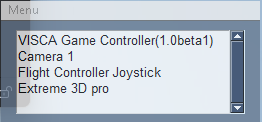
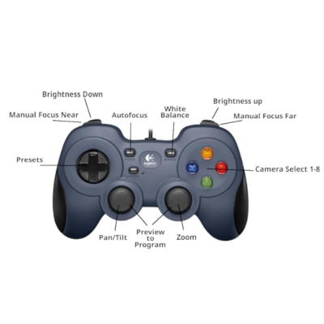

# VISCA-Game-Controller

An application to control PTZ Cameras using the [SONY VISCA Protocol](https://www.sony.net/Products/CameraSystem/CA/BRC_X1000_BRC_H800/Technical_Document/C456100121.pdf) and a USB Game Controller

This program was originally based on the project https://github.com/International-Anglican-Church/visca-joystick and uses the VISCA camera library https://github.com/misterhay/VISCA-IP-Controller. It has been extensively rewritten to support such things as
- a windowed interface and a Windows System Tray icon (using PySimpleGUI/PSGTray)
- hot plugin/removal of controllers
- support for up to 8 cameras (for use with [Blackmagic Design ATEM ISO Extreme](https://www.blackmagicdesign.com/products/atemmini))
- integration with BitFocus Companion to automatically put selected cameras into the preview/program window
- additional functions for minimal white balance control (One Push, Auto)
- some rearrangement of functions between buttons/joysticks/hats on the controller based on the principle of "it seemed to me to work better that way"
- bug fixes and hardening

At this point the code and functionality has changed too much to be merged back with the original project


## Intended use

This is intended to be used as part of a livestreaming video system consisting of:
- A Windows PC (or possibly Linux or Mac. I have tested this extensively under Windows 11, but in principle the code could run on other systems that can run OBS or other streaming software)
- An inexpensive USB game controller, such as
  - the [Logitech F310](https://www.amazon.com/Logitech-940-000110-Gamepad-F310/). It should also work with any controller with a similar set of controls and buttons, including [cheap generic controllers from AliExpress](https://www.aliexpress.us/item/3256806491970358.html).
  - the [LogiTech Extreme 3D PRO](https://www.logitechg.com/en-us/products/space/extreme-3d-pro-joystick.html) Flight Simulator joystick.
- PTZ cameras supporting SONY VISCA protocol and [NDI](https://ndi.video/). I have tested with cameras from [AVKANS](https://www.amazon.com/AVKANS-Tracking-Camera-Streaming-Worship/dp/B0CM91M5LN), Birddog ([P100](https://birddog.tv/p100-overview/) and [X1](https://birddog.tv/x1-overview/)), and [OBSBOT](https://www.obsbot.com/obsbot-tail-air-streaming-camera)
- [BlackMagic Design ATEM](https://www.blackmagicdesign.com/products/atemmini), [VMix](https://www.vmix.com/) or [OBS](https://obsproject.com/) for camera streaming
- my [NDI Camera Selector](https://github.com/DanTappan/NDI-Camera-Selector) program for selecting between NDI based cameras and forwarding VISCA packets (this is not required, but is useful for dynamically selecting cameras without requiring reconfiguration of the Game Controller app)
- [Bitfocus Companion](https://bitfocus.io/companion), used for mapping the selected camera to the Preview window and switching the Preview to Program 

For example:


## How to install

Either use the [Windows installer](https://dantappan.net/projects#VISCA-Game-Controller) or clone the sources and run them in your favorite IDE.

## How to use

Run the program. It will create a System Tray icon and a small "Feedback window" that can be repositioned or hidden.



I generally keep the Feedback Window in the lower right of the screen.


 
The window provides a dropdown menu with the following commands


- "Minimize" - minimizes/hides the feedback window. To show the window again after hiding, see the system tray popup menu
- "Configure" - puts up a configuration dialog for the program
- "Help" - displays help text
- "Credits" - displays credits text
- "Exit" - closes the program

Right-clicking on the System Tray icon provides a popup menu with the following commands


- "Show Window" - restores the feedback window after hiding
- "Center Window" - in case the window somehow gets moved off-screen, this moves it back to the center of the screen
- "Exit" - closes the program

The Configuration dialog allows setting the following parameters:


- "Camera" and "Port" set the camera address and VISCA port for each camera. The default port number for SONY VISCA is 52381. If the program is being used in conjunction with the [NDI Camera Selector](https://github.com/DanTappan/NDI-Camera-Selector) application (which automatically forwards VISCA packets to the camera selected for the appropriate slot), then the camera address should set to 127.0.0.1 (localhost) and the port to 10000+*camera number*. See the "Relay" button below.
- "Long Press" - the timeout value for a long press vs a short press of a button.
The program must be restarted for a change to take effect.
- "Dead Zone". This sets the size of the center dead zone, where the joysticks will not respond.
This is useful for noisy analog joysticks that do not zero properly. 
It is also useful for the *Logitech Extreme 3D PRO*, where moving the stick tends to also twist the stick (Zoom function).
Setting the value in the configuration dialog will override any default values selected by the program.
Program restart is required for a change to take effect.
- "Bitfocus Companion Host" and "Bitfocus Companion Page" select the address of the machine running BitFocus Companion and
the page used for the Bitfocus Companion trigger functions.
See section [Bitfocus Companion Integrations](#bitfocus-companion-integrations).
- "Invert Tilt" - reverses the sense of the tilt joystick control
- "Swap Pan" - reverses the sense of the pan joystick control
- "Debug Mode" - enables some debugging functions
- "Relay" - automatically fills in the Camera&Port fields with the correct values for operation with the [NDI Camera Selector](https://github.com/DanTappan/NDI-Camera-Selector) VISCA Relay function.

## Controller Functions

The program supports the following functions using a game controller



<table>
<tr>
<td><b>Function</b></td>
<td><b>Controller input</b></td>
</tr>
<tr>
<td>
Select camera 1-8. If BitFocus Companion is running (and properly configured) this also sets the Preview window to the selected camera
</td>
<td>
Buttons A, B, X, Y - short press selects 1-4, long press selects 5-8
</td>
</tr>
<tr>
<td>
Pan/Tilt the camera
</td>
<td>
Left joystick
</td>
</tr>
<tr>
<td>
Zoom the camera
</td>
<td>
Right joystick
</td>
</tr>
<tr>
<td>
Autofocus mode
</td>
<td>
Left hand button on controller, often labeled 'next'
</td>
</tr>
<tr>
<td>
White balance. A short push selects "one push white balance". A long push selects auto white balance.
</td>
<td>
Right hand button on controller, often labeled 'back'
</td>
</tr>
<tr>
<td>
Manual Focus Near/Far. Push the left trigger to start focusing nearer (as in, closer to the operator), release to stop. Similarly, the right trigger focuses further away.
</td>
<td>
Left and right trigger
</td>
</tr>
<tr>
<td>
Increase/Decrease brightness. Push the left button to increase, the right to decrease.
</td>
<td>
Left and right front buttons
</td>
</tr>
<tr>
<td>
Preview to Program. If Bitfocus Companion is running (and properly configured) then the Preview window is swapped with the Program window
</td>
<td>
Left or right joystick button
</td>
</tr>
<tr>
<td>
Preset. The 8 possible directions on the D-pad/"Hat" each select one of presets 1-8. A short push recalls the preset. A long push sets the preset
</td>
<td>D-pad/"Hat"</td>
</tr>
</table>

The Program supports the following functions using a Flight Simulator Joystick, such as the [Logitech Extreme 3D Pro](https://www.logitechg.com/en-us/products/space/extreme-3d-pro-joystick.963290-0403.html)


<Table>
<tr>
<td><b>Function</b></td>
<td><b>Controller input</b></td>
</tr>
 <tr>
<td>
Pan/Tilt the camera
</td>
<td>
Move the joystick left to right (pan) or back and forth (tilt)
</td>
</tr>
 <tr>
<td>
Zoom the camera
</td>
<td>
Twist the joystick
</td>
</tr>
<tr>
<td>
Select camera 1-8. If BitFocus Companion is running (and properly configured) this also sets the Preview window to the selected camera
</td>
<td>
The 4 buttons on the top of the joystick. Short push selects 1-4, long push 5-8
</td>
</tr>
<tr>
<td>
White balance. A short push selects "one push white balance". A long push selects auto white balance.
</td>
<td>
Side trigger
</td>
</tr>
<tr>
<td>
Focus
</td>
<td>
mini-DPad/"Hat" on the top of the joystick. Push up to manually focus further out, down to focus nearer, side to side selects autofocus mode
</td>
</tr>
<tr>
<td>
Increase/Decrease brightness. Push the left button to increase, the right to decrease.
</td>
<td>
Left and right front buttons
</td>
</tr>
<tr>
<td>
Preview to Program. If Bitfocus Companion is running (and properly configured) then the Preview window is swapped with the Program window
</td>
<td>
Front trigger
</td>
</tr>
<tr>
<td>
Presets 1-6
</td>
<td>Base buttons. A long push sets the preset, a short push recalls</td>
</tr>
</table>

## Bitfocus Companion integrations
The following features support interactions between the application and [Bitfocus Companion](https://bitfocus.io/companion)

### Companion triggers

To implement the features of automatically putting the selected camera into the preview window, and the 
"Preview to Program" function, the program requires a connection to an instance of BitFocus Companion. 
For this to work, the Companion instance must be configured to support the UDP Raw Socket API, and to allow connections
from the machine running the Game Controller application. 
See the [BitFocus Companion documentation](https://user.bitfocus.io/docs/companion).

In order to implement these functions, the program assumes that one page of buttons in Bitfocus Companion are configured as follows:
- Row 0, columns 1-8 : Select camera 1-8 as the Preview
- Row 1, column 1 : Fade/Cut the Preview to the Program

The Companion host address and the page containing the trigger buttons can be configured using the Configuration dialog

### OSC Interface

To support actions triggered by Companion, the application provides a UDP
[Open Sound Control(OSC)](https://en.wikipedia.org/wiki/Open_Sound_Control) on port 9999. 
Currently, the supported commands are:
* /setcam/_number_ to select the indicated camera. This supports using Companion buttons to select cameras.

### VISCA Relay

The VISCA Relay runs on UDP port 10000 and allows an appropriately configured Companion "SONY VISCA" connection to send
VISCA commands to the currently selected camera. 
Specifically, any VISCA command received on port 10000 will be forwarded to the current camera, and the camera's
response will be forwarded back.

This allows Companion to provide functions beyond those supported by the buttons on the current Game Controller or Joystick.

## Python Packages used
- numpy
- pillow
- psgtray-foss
- pygame-ce
- pyinstaller
- PySimpleGUI-4-foss
- pystray

## PyCharm pyinstaller settings

The following settings for pyi-makespec under PyCharm work to build the program. 

Program (run on main program file):
````
$FileDir$\.venv\Scripts\\pyi-makespec
````
Arguments:
````
--onedir
--windowed
--additional-hooks-dir=.
--name
$FileDirName$
--icon=$FileDirName$.ico
--version-file
$FileDir$\version_info.rs
--add-data
$FileDirName$.png;.
--add-data
$FileDirName$.ico;.
$FilePath$
````
Working Directory:
```
$FileDir$
```

Program (run on resulting spec file):
```
$ProjectFileDir$\.venv\Scripts\pyinstaller.exe
```

Arguments:
```
-y
--clean
$FilePath$
```

Working Directory:
```
$FileDir$
```

I use [InstallForge](https://installforge.net/) to build the installer. There is a [template InstallForge file](Installer.ifp) in the repository, but it will probably require editing.


